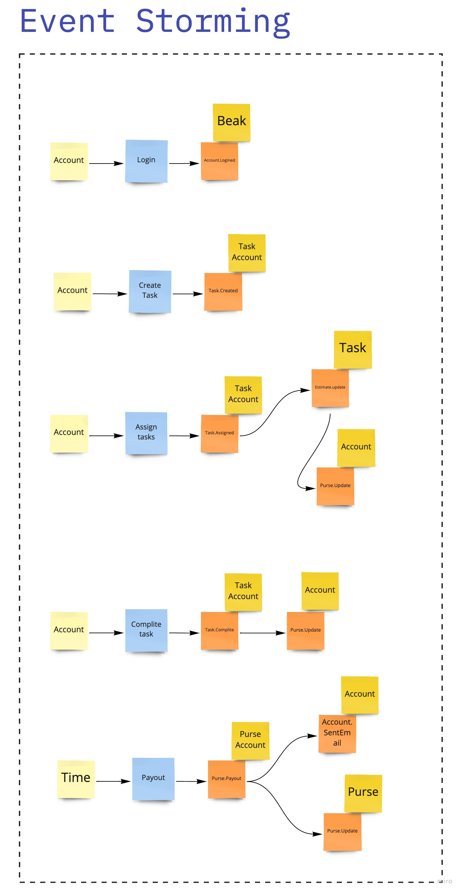

# Event Storming


> Разобрать каждое требование на составляющие (актор, команда, событие, query). 
> Определить, как все бизнес цепочки будут выглядеть и на какие шаги они будут разбиваться.


```
{
    Actor: Account
    Command: Login to task traker
    Data: beak
    Event: Account.Logined
}
```

```
{
    Actor: Account
    Command: Create task
    Data: Task Account.id Popug.id
    Event: Task.Created
}
```

```
{
    Actor: Account
    Command: Assign task
    Data: Task Account
    Event: Task.Assign 
}
```

```
{
    Actor: Account
    Command: Complite task
    Data: Task
    Event: Task.Complite
}
```

```
{
    Actor: Task.Assign
    Command: Estimate update
    Data: Task Estimate
    Event: Estimate.Updated
}
```

```
{
    Actor: Task.Assessed
    Command: Забираем деньги у попуга
    Data: Purse
    Event: Purse.Update
}
```


```
{
    Actor: Task.Complite
    Command: Начисляем деньги попугу
    Data: Purse
    Event: Purse.Update
}
```

```
{
    Actor: Time
    Command: Payout
    Data: Purse Task
    Event: Purse.Payout
}
```

```
{
    Actor: Purse.Payout
    Command: Sent email
    Data: Account Purse
    Event: Account.SentEmail
}
```


