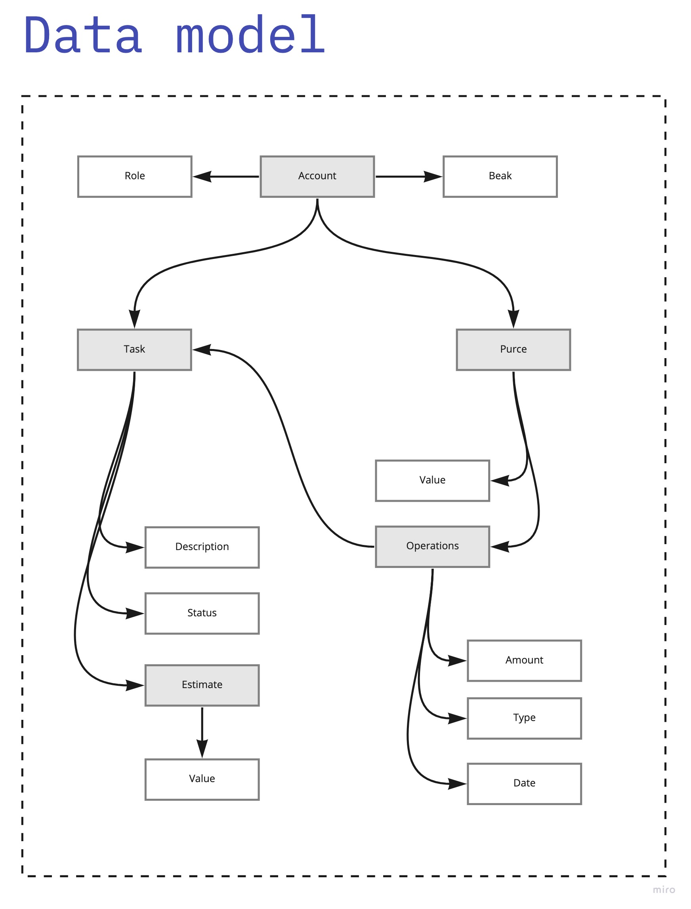

# Total Data

> Построить модель данных для системы и модель доменов. 
> Рисовать можно в любом удобном инструменте (включая обычную бумагу), 
> главное, чтобы это было не только у вас в голове, но и где-то вовне. 
> Благодаря этому вы сможете сфокусироваться на отдельной части системы, 
> не думая о других. А также показать свое решение одногрупникам/коллегам.

