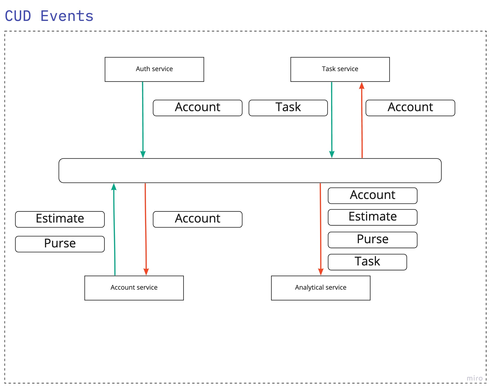

# Events

> Определить все бизнес события, необходимые для работы системы. 
> Отобразить кто из сервисов является продьюсером, а кто консьюмером бизнес событий.

> Выписать все CUD события и какие данные нужны для этих событий, которые необходимы для работы системы. 
> Отобразить кто из сервисов является продьюсером, а кто консьюмером CUD событий.
 
> 
